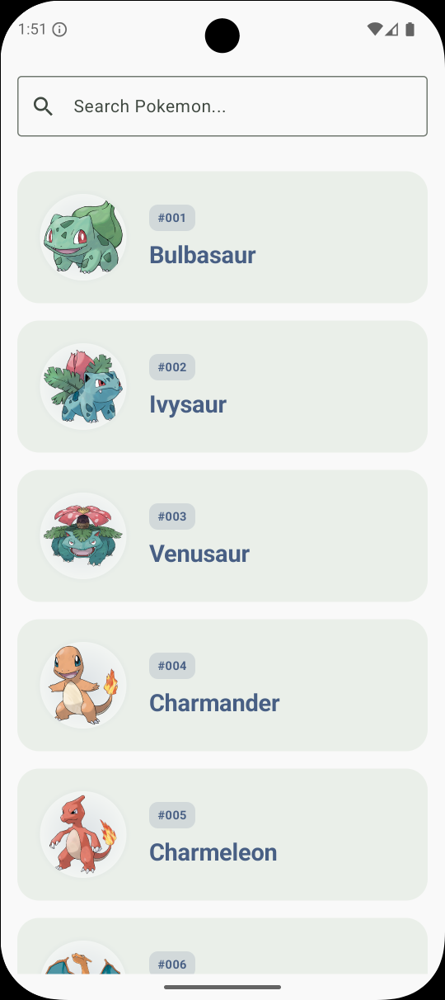
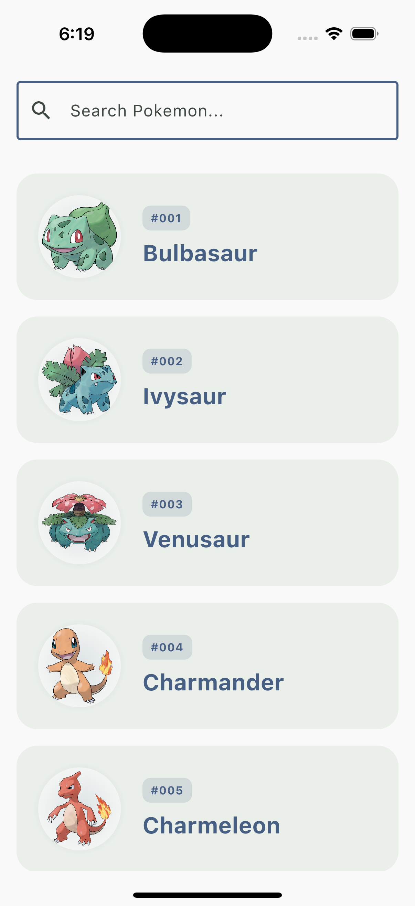
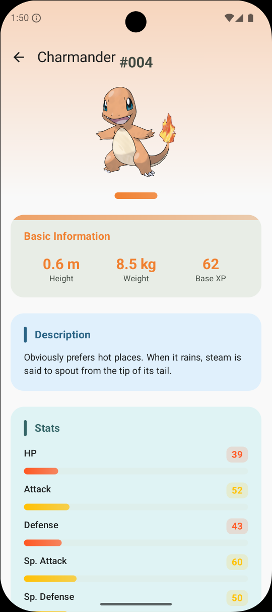
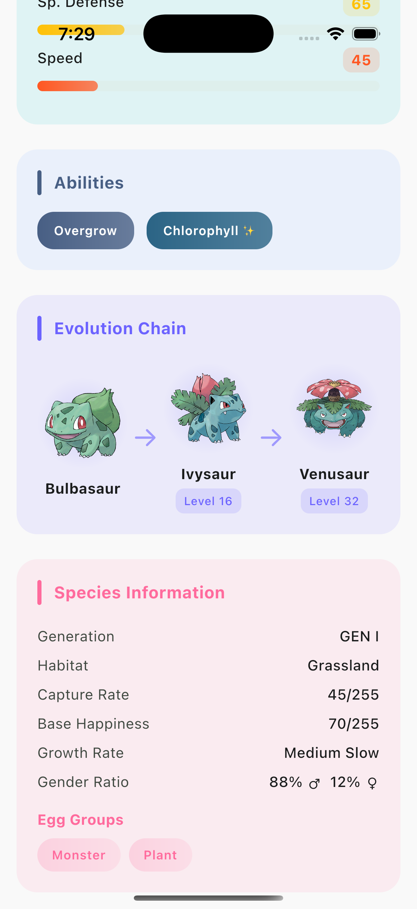
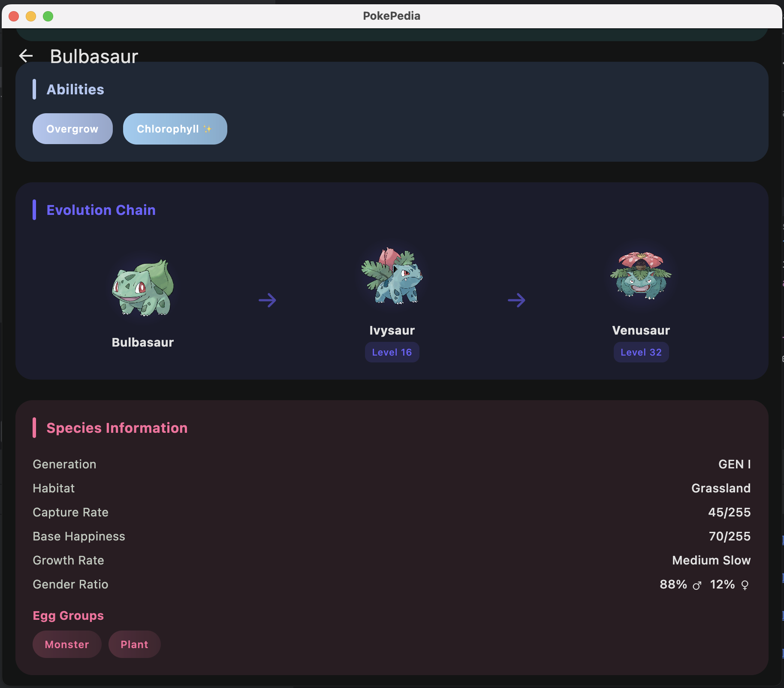

# PokePedia

A modern Kotlin Multiplatform application that showcases Pokémon data with a beautiful, responsive UI. Built with Compose Multiplatform, it provides a seamless experience across Android, iOS, and Desktop platforms.

## ✨ Features

- **📱 Multiplatform Support**: Runs on Android, iOS, and Desktop
- **🔍 Pokémon Discovery**: Browse and search through a comprehensive Pokémon database
- **📊 Detailed Information**: View detailed stats, abilities, types, and sprites for each Pokémon
- **🎨 Modern UI**: Beautiful Material 3 design with adaptive layouts
- **💾 Offline Support**: Local caching with Room database
- **🔄 Real-time Data**: Live data from PokéAPI with intelligent caching
- **🌙 Dark/Light Theme**: Adaptive theming with Material Kolor
- **📱 Responsive Design**: Optimized for different screen sizes and orientations

## 🏗️ Architecture

PokePedia follows **Clean Architecture** principles with a clear separation of concerns across three main layers:

### Architecture Diagram

```
┌─────────────────────────────────────────────────────────────┐
│                    Presentation Layer                       │
│  ┌─────────────────┐  ┌─────────────────┐  ┌─────────────┐ │
│  │   Android UI    │  │    iOS UI       │  │ Desktop UI  │ │
│  │   (Compose)     │  │   (Compose)     │  │  (Compose)  │ │
│  └─────────────────┘  └─────────────────┘  └─────────────┘ │
│  ┌─────────────────────────────────────────────────────────┐ │
│  │              ViewModels & State Management              │ │
│  └─────────────────────────────────────────────────────────┘ │
└─────────────────────────────────────────────────────────────┘
                                │
                                ▼
┌─────────────────────────────────────────────────────────────┐
│                      Domain Layer                           │
│  ┌─────────────────┐  ┌─────────────────┐  ┌─────────────┐ │
│  │   Entities      │  │  Repository     │  │   Use Cases │ │
│  │   (Pokemon)     │  │  Interfaces     │  │             │ │
│  └─────────────────┘  └─────────────────┘  └─────────────┘ │
└─────────────────────────────────────────────────────────────┘
                                │
                                ▼
┌─────────────────────────────────────────────────────────────┐
│                       Data Layer                            │
│  ┌─────────────────┐  ┌─────────────────┐  ┌─────────────┐ │
│  │   Remote Data   │  │   Local Data    │  │  Repository │ │
│  │   (PokéAPI)     │  │   (Room DB)     │  │  Impl       │ │
│  └─────────────────┘  └─────────────────┘  └─────────────┘ │
└─────────────────────────────────────────────────────────────┘
```

### Layer Responsibilities

- **🎨 Presentation Layer**: Handles UI logic, state management, and user interactions using Compose Multiplatform
- **🧠 Domain Layer**: Contains business logic, entities, and repository interfaces
- **💾 Data Layer**: Manages data sources (API, database) and implements repository contracts

## 🛠️ Tech Stack

### Core Technologies
- **Kotlin** `2.2.20` - Primary programming language
- **Compose Multiplatform** `1.9.0` - Modern declarative UI framework
- **Kotlin Multiplatform** - Shared business logic across platforms

### Networking & Data
- **Ktor** `3.3.0` - HTTP client for API communication
- **Kotlinx Serialization** `1.9.0` - JSON serialization/deserialization
- **Room** `2.8.1` - Local database with SQLite
- **SQLite Bundled** `2.6.1` - Embedded database driver

### Dependency Injection & Architecture
- **Koin** `4.1.1` - Lightweight dependency injection framework
- **AndroidX Lifecycle** `2.9.4` - Lifecycle-aware components
- **AndroidX Navigation** `2.9.0` - Navigation between screens

### UI & Experience
- **Material 3** - Modern Material Design components
- **Material Icons Extended** `1.7.3` - Comprehensive icon set
- **Material Kolor** `3.0.1` - Dynamic color theming
- **Compose Adaptive** `1.2.0-alpha06` - Adaptive layouts for different screen sizes
- **Coil** `3.3.0` - Image loading and caching

### Development Tools
- **KSP** `2.2.20-2.0.3` - Kotlin Symbol Processing for code generation
- **BuildConfig** `5.6.8` - Build-time configuration
- **Kermit** `2.0.8` - Multiplatform logging
- **Hot Reload** `1.0.0-beta08` - Fast development iteration

### Testing
- **Kotlinx Coroutines Test** `1.10.2` - Testing coroutines
- **Compose UI Test** - UI testing framework
- **AndroidX UI Test** `1.9.1` - Android-specific UI testing

## 📱 Screenshots

| Android | iOS | Desktop |
|---------|-----|---------|
|  |  |  |
|  |  |  |

## 🚀 Getting Started

### Prerequisites

- **Android Studio** (latest version recommended)
- **Kotlin Multiplatform Mobile** plugin
- **Xcode** (for iOS development)
- **JDK 17** or higher

### Installation

1. **Clone the repository**
   ```bash
   git clone https://github.com/TheSomeshKumar/PokePedia.git
   cd PokePedia
   ```

2. **Open in Android Studio**
   - Open Android Studio
   - Select "Open an existing project"
   - Navigate to the cloned directory and select it
   - Wait for Gradle sync to complete

3. **Configure API Key** (Optional)
   - Create a `local.properties` file in the root directory
   - Add your PokéAPI key (if you have one):
     ```properties
     API_KEY=your_api_key_here
     ```
   - Note: The app works without an API key using public endpoints

4. **Run the application**
   - **Android**: Select an Android device/emulator and click Run
   - **iOS**: Select an iOS simulator and click Run (requires macOS)
   - **Desktop**: Select "Desktop" and click Run

### Building for Production

```bash
# Build Android APK
./gradlew :composeApp:assembleRelease

# Build iOS (requires macOS)
./gradlew :composeApp:linkDebugFrameworkIosArm64

# Build Desktop
./gradlew :composeApp:packageDistributionForCurrentOS
```

## 🏛️ Project Structure

```
PokePedia/
├── composeApp/
│   ├── src/
│   │   ├── commonMain/kotlin/
│   │   │   └── com/thesomeshkumar/pokepedia/
│   │   │       ├── core/                    # Core utilities and shared components
│   │   │       │   ├── data/               # HTTP client, data sources
│   │   │       │   ├── domain/             # Error handling, core entities
│   │   │       │   └── presentation/       # UI utilities, animations
│   │   │       ├── pokemon/                # Pokémon feature module
│   │   │       │   ├── data/               # Data layer implementation
│   │   │       │   │   ├── database/       # Room entities and DAOs
│   │   │       │   │   ├── dto/           # Data Transfer Objects
│   │   │       │   │   ├── mappers/       # DTO to Domain mappers
│   │   │       │   │   ├── network/       # API data sources
│   │   │       │   │   └── repository/    # Repository implementations
│   │   │       │   ├── domain/            # Domain layer
│   │   │       │   │   ├── Pokemon.kt     # Core Pokémon entity
│   │   │       │   │   └── PokemonRepository.kt # Repository interface
│   │   │       │   └── presentation/      # Presentation layer
│   │   │       │       ├── pokemon_list/  # Pokémon list screen
│   │   │       │       └── pokemon_detail/ # Pokémon detail screen
│   │   │       └── di/                    # Dependency injection modules
│   │   ├── androidMain/                   # Android-specific code
│   │   ├── iosMain/                       # iOS-specific code
│   │   └── jvmMain/                       # Desktop-specific code
│   └── build.gradle.kts
├── iosApp/                                # iOS app wrapper
├── gradle/
│   └── libs.versions.toml                # Version catalog
└── build.gradle.kts
```

## 🔧 Key Features Implementation

### State Management
- **StateFlow** for reactive state management
- **ViewModel** pattern for UI state handling
- **Immutable state** objects for predictable UI updates

### Data Flow
- **Repository Pattern** for data abstraction
- **Offline-first** approach with intelligent caching
- **Error handling** with Result types and user-friendly messages

### UI/UX
- **Material 3** design system
- **Adaptive layouts** for different screen sizes
- **Smooth animations** and transitions
- **Accessibility** support

## 🤝 Contributing

Contributions are welcome! Please feel free to submit a Pull Request. For major changes, please open an issue first to discuss what you would like to change.

1. Fork the repository
2. Create your feature branch (`git checkout -b feature/AmazingFeature`)
3. Commit your changes (`git commit -m 'Add some AmazingFeature'`)
4. Push to the branch (`git push origin feature/AmazingFeature`)
5. Open a Pull Request

## 📄 License

This project is licensed under the MIT License - see the [LICENSE](LICENSE) file for details.

## 🙏 Acknowledgments

- [PokéAPI](https://pokeapi.co/) for providing the comprehensive Pokémon data
- [JetBrains](https://www.jetbrains.com/) for the amazing Kotlin Multiplatform technology
- [Compose Multiplatform](https://www.jetbrains.com/lp/compose-multiplatform/) for the modern UI framework
- The open-source community for the excellent libraries and tools

## 📞 Contact

**Somesh Kumar** - [@TheSomeshKumar](https://github.com/TheSomeshKumar)

Project Link: [https://github.com/TheSomeshKumar/PokePedia](https://github.com/TheSomeshKumar/PokePedia)

---

⭐ **Star this repository if you found it helpful!**