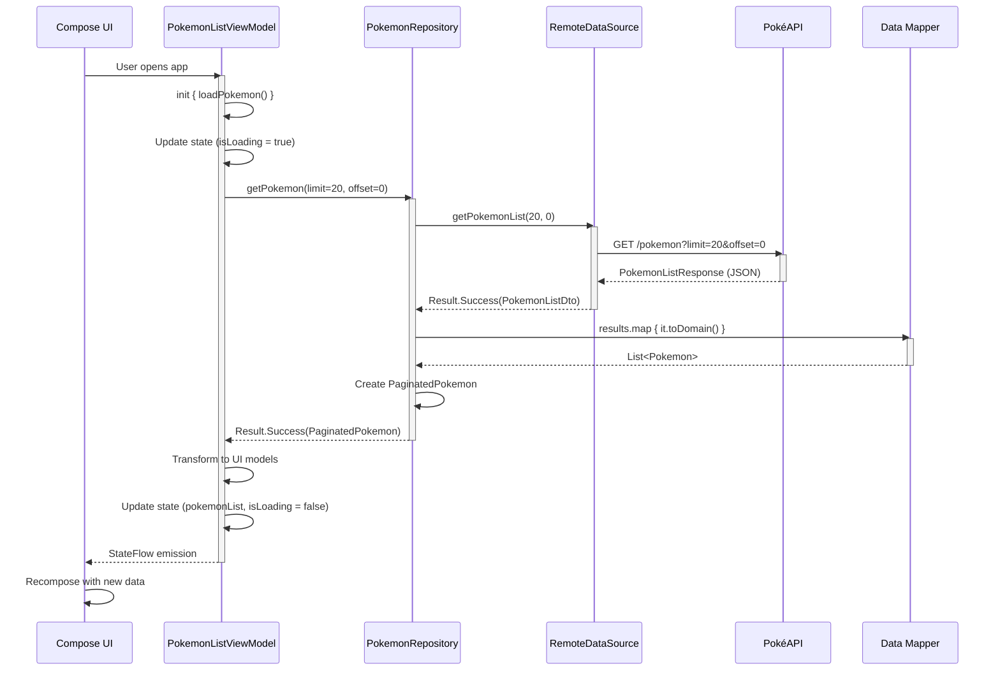
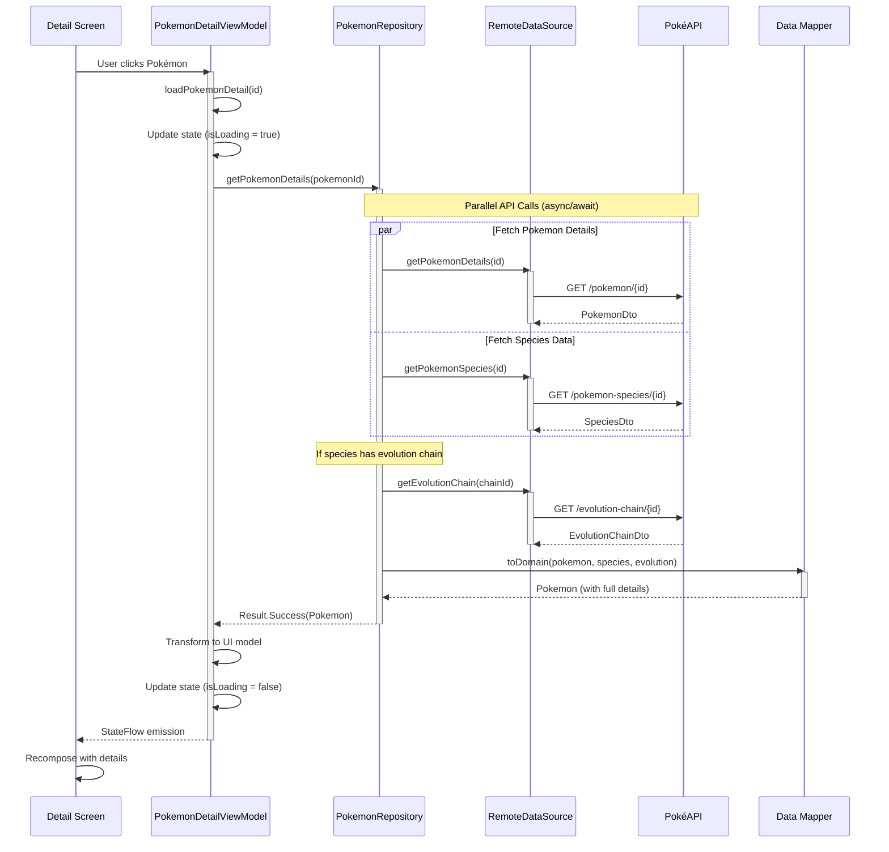
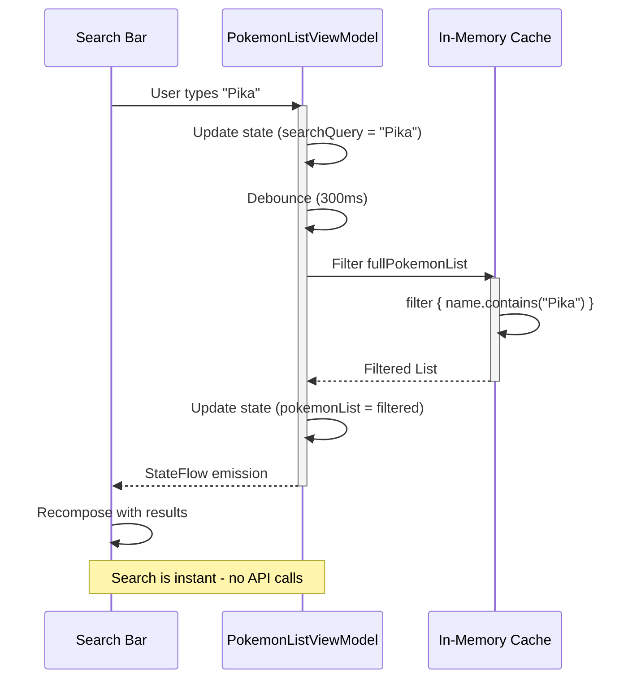
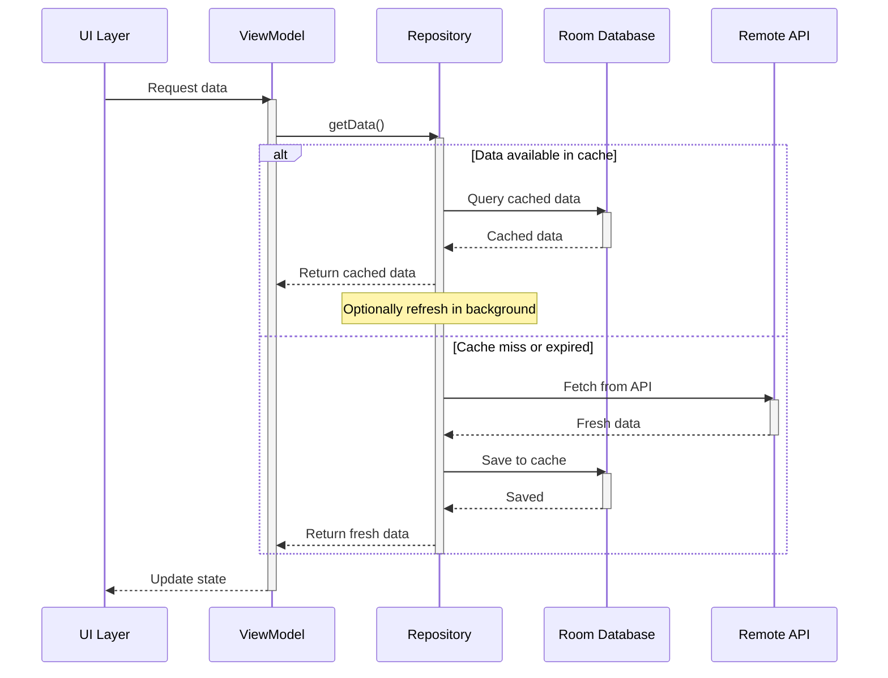

<div align="center">

# 🎮 PokePedia

[//]: # ()

### A Modern Kotlin Multiplatform Pokémon Encyclopedia

[](https://kotlinlang.org)
[](https://github.com/JetBrains/compose-multiplatform)
[](https://ktor.io/)
[](https://developer.android.com/jetpack/androidx/releases/room)
[](LICENSE)

[Features](#-features) • [Architecture](#-architecture) • [Tech Stack](#-tech-stack) • [Getting Started](#-getting-started) • [Contributing](#-contributing)

</div>

---

## 📱 About

**PokePedia** is a modern, cross-platform Pokémon encyclopedia application built with Kotlin Multiplatform and Compose Multiplatform. It provides a seamless experience for exploring Pokémon data across Android, iOS, and Desktop platforms with offline-first architecture and beautiful Material 3 design.

Powered by [PokéAPI](https://pokeapi.co/), PokePedia offers comprehensive Pokémon information including stats, abilities, types, evolution chains, and more - all with a clean, intuitive interface optimized for different screen sizes.

---

## ✨ Features

### 🔍 Core Features
- **📚 Browse Pokémon**: Explore an extensive database of Pokémon with infinite scroll pagination
- **🔎 Smart Search**: Real-time search with instant filtering of Pokémon by name
- **📊 Detailed Information**: View comprehensive stats, abilities, types, and characteristics
- **🧬 Evolution Chains**: Visualize complete evolution paths with methods and requirements
- **🎨 Type Colors**: Dynamic theming based on Pokémon types with Material Kolor
- **🖼️ High-Quality Images**: Official artwork and sprites for every Pokémon
- **📈 Stats Visualization**: Visual representation of base stats with comparison

### 💾 Technical Features
- **🌐 Multiplatform Support**: Single codebase for Android, iOS, and Desktop
- **📴 Offline-First**: Local caching with Room database for offline access
- **⚡ Fast Performance**: Parallel API calls and intelligent data loading
- **🔄 Real-time Updates**: Reactive state management with StateFlow
- **🎭 Material 3 Design**: Modern UI with dynamic color theming
- **📱 Responsive Layouts**: Adaptive UI for phones, tablets, and desktops
- **🌙 Theme Support**: Light and dark theme with system preference detection
- **♿ Accessibility**: Screen reader support and accessible UI components

---

## 📸 Screenshots

### Android
<p align="center">

[//]: # (  )

[//]: # (  )

[//]: # (  )
</p>

### iOS
<p align="center">

[//]: # (  )

[//]: # (  )

[//]: # (  )
</p>

### Desktop
<p align="center">

[//]: # (  )

[//]: # (  )
</p>

---

## 🏗️ Architecture

PokePedia follows **Clean Architecture** principles with clear separation of concerns, ensuring maintainability, testability, and scalability.

### 📐 Architecture Layers

```
┌────────────────────────────────────────────────────────────────┐
│                     PRESENTATION LAYER                         │
│                                                                │
│  ┌──────────────┐  ┌──────────────┐  ┌──────────────┐        │
│  │  Android UI  │  │   iOS UI     │  │  Desktop UI  │        │
│  │  (Compose)   │  │  (Compose)   │  │  (Compose)   │        │
│  └──────────────┘  └──────────────┘  └──────────────┘        │
│                                                                │
│  ┌────────────────────────────────────────────────────────┐   │
│  │           ViewModels & State Management                │   │
│  │     (PokemonListViewModel, PokemonDetailViewModel)     │   │
│  │                                                         │   │
│  │  • StateFlow for reactive state                        │   │
│  │  • Action-based event handling                         │   │
│  │  • UI state transformations                            │   │
│  └────────────────────────────────────────────────────────┘   │
└────────────────────────────────────────────────────────────────┘
                              │
                              ▼
┌────────────────────────────────────────────────────────────────┐
│                       DOMAIN LAYER                             │
│                                                                │
│  ┌────────────────────────────────────────────────────────┐   │
│  │                  Business Logic                        │   │
│  │                                                         │   │
│  │  📦 Entities: Pokemon, PokemonType, Stats, Species     │   │
│  │  🔌 Interfaces: PokemonRepository                      │   │
│  │  ⚠️  Error Handling: Result, DataError                 │   │
│  │                                                         │   │
│  │  • Pure Kotlin - No framework dependencies             │   │
│  │  • Platform-agnostic business rules                    │   │
│  └────────────────────────────────────────────────────────┘   │
└────────────────────────────────────────────────────────────────┘
                              │
                              ▼
┌────────────────────────────────────────────────────────────────┐
│                        DATA LAYER                              │
│                                                                │
│  ┌─────────────────────────────────────────────────────────┐  │
│  │         Repository Implementation                       │  │
│  │        (DefaultPokemonRepository)                       │  │
│  │                                                          │  │
│  │  • Coordinates data sources                             │  │
│  │  • Handles caching strategy                             │  │
│  │  • Maps DTOs to Domain models                           │  │
│  └─────────────────────────────────────────────────────────┘  │
│                                                                │
│  ┌──────────────────────┐      ┌──────────────────────┐       │
│  │  Remote Data Source  │      │  Local Data Source   │       │
│  │      (PokéAPI)       │      │    (Room Database)   │       │
│  │                      │      │                      │       │
│  │  • Ktor HTTP Client  │      │  • SQLite storage    │       │
│  │  • JSON parsing      │      │  • DAO operations    │       │
│  │  • API endpoints     │      │  • Offline cache     │       │
│  └──────────────────────┘      └──────────────────────┘       │
└────────────────────────────────────────────────────────────────┘
```

### 🔄 Data Flow Sequence Diagrams

#### 1. Pokémon List Loading Flow



#### 2. Pokémon Detail Loading Flow



#### 3. Search Flow



#### 4. Offline-First Caching Strategy



### 🎯 Layer Responsibilities

| Layer | Responsibilities | Technologies |
|-------|-----------------|--------------|
| **🎨 Presentation** | • UI rendering and user interactions<br>• State management and events<br>• Navigation between screens<br>• Platform-specific UI adaptations | Compose Multiplatform<br>StateFlow<br>Material 3<br>Coil (image loading) |
| **🧠 Domain** | • Business logic and rules<br>• Entity definitions<br>• Repository interfaces<br>• Use case orchestration | Pure Kotlin<br>No dependencies |
| **💾 Data** | • Repository implementations<br>• Data source management<br>• DTO to Domain mapping<br>• Network and database operations | Ktor Client<br>Room Database<br>Kotlinx Serialization |

---

## 🛠️ Tech Stack

### Core Framework
| Technology | Version | Purpose |
|------------|---------|---------|
| [Kotlin](https://kotlinlang.org/) | 2.2.20 | Primary programming language |
| [Compose Multiplatform](https://www.jetbrains.com/lp/compose-multiplatform/) | 1.9.0 | Declarative UI framework |
| [Kotlin Multiplatform](https://kotlinlang.org/docs/multiplatform.html) | 2.2.20 | Cross-platform code sharing |

### Networking & Serialization
| Technology | Version | Purpose |
|------------|---------|---------|
| [Ktor Client](https://ktor.io/) | 3.3.0 | HTTP client for API calls |
| [Kotlinx Serialization](https://github.com/Kotlin/kotlinx.serialization) | 1.9.0 | JSON parsing and serialization |

### Local Storage
| Technology | Version | Purpose |
|------------|---------|---------|
| [Room](https://developer.android.com/jetpack/androidx/releases/room) | 2.8.1 | Local database with type-safe queries |
| [SQLite Bundled](https://developer.android.com/jetpack/androidx/releases/sqlite) | 2.6.1 | Embedded database engine |

### Dependency Injection
| Technology | Version | Purpose |
|------------|---------|---------|
| [Koin](https://insert-koin.io/) | 4.1.1 | Lightweight dependency injection |

### Architecture Components
| Technology | Version | Purpose |
|------------|---------|---------|
| [AndroidX Lifecycle](https://developer.android.com/jetpack/androidx/releases/lifecycle) | 2.9.4 | ViewModel and lifecycle management |
| [AndroidX Navigation](https://developer.android.com/jetpack/androidx/releases/navigation) | 2.9.0 | Type-safe navigation |
| [Kotlinx Coroutines](https://github.com/Kotlin/kotlinx.coroutines) | 1.10.2 | Asynchronous programming |

### UI & Design
| Technology | Version | Purpose |
|------------|---------|---------|
| [Material 3](https://m3.material.io/) | Latest | Material Design components |
| [Material Icons Extended](https://developer.android.com/jetpack/androidx/releases/compose-material) | 1.7.3 | Comprehensive icon library |
| [Material Kolor](https://github.com/jordond/materialkolor) | 3.0.1 | Dynamic color theming from images |
| [Compose Adaptive](https://developer.android.com/jetpack/androidx/releases/compose-material3-adaptive) | 1.2.0-alpha06 | Adaptive layouts for different screens |
| [Coil](https://coil-kt.github.io/coil/) | 3.3.0 | Image loading with caching |

### Development Tools
| Technology | Version | Purpose |
|------------|---------|---------|
| [KSP](https://github.com/google/ksp) | 2.2.20-2.0.3 | Kotlin Symbol Processing |
| [BuildConfig](https://github.com/gmazzo/gradle-buildconfig-plugin) | 5.6.8 | Build-time configuration |
| [Kermit](https://github.com/touchlab/Kermit) | 2.0.8 | Multiplatform logging |
| [Hot Reload](https://github.com/JetBrains/compose-hot-reload) | 1.0.0-beta08 | Fast development iteration |

### Testing
| Technology | Version | Purpose |
|------------|---------|---------|
| [Kotlinx Coroutines Test](https://github.com/Kotlin/kotlinx.coroutines) | 1.10.2 | Coroutine testing utilities |
| [Compose UI Test](https://developer.android.com/jetpack/compose/testing) | Latest | UI testing for Compose |
| [JUnit 4](https://junit.org/junit4/) | Latest | Unit testing framework |

---

## 📁 Project Structure

```
PokePedia/
│
├── composeApp/                              # Main application module
│   ├── src/
│   │   ├── commonMain/kotlin/              # Shared code for all platforms
│   │   │   └── com/thesomeshkumar/pokepedia/
│   │   │       │
│   │   │       ├── app/                    # Application entry point
│   │   │       │   ├── App.kt              # Main Composable app
│   │   │       │   └── navigation/         # Navigation setup
│   │   │       │       ├── Routes.kt       # Screen routes
│   │   │       │       └── NavigationExtensions.kt
│   │   │       │
│   │   │       ├── core/                   # Core utilities (shared)
│   │   │       │   ├── data/
│   │   │       │   │   ├── HttpClientFactory.kt      # Ktor client setup
│   │   │       │   │   └── HttpClientExt.kt          # HTTP extensions
│   │   │       │   ├── domain/
│   │   │       │   │   ├── Result.kt       # Result wrapper for success/error
│   │   │       │   │   ├── Error.kt        # Base error interface
│   │   │       │   │   └── DataError.kt    # Data layer errors
│   │   │       │   └── presentation/
│   │   │       │       ├── UiText.kt       # Localized string wrapper
│   │   │       │       ├── PulseAnimation.kt         # Reusable animations
│   │   │       │       └── DataErrorToStringResource.kt
│   │   │       │
│   │   │       ├── pokemon/                # Pokémon feature module
│   │   │       │   │
│   │   │       │   ├── data/               # Data Layer
│   │   │       │   │   ├── database/
│   │   │       │   │   │   ├── PokemonDatabase.kt   # Room database
│   │   │       │   │   │   ├── PokemonDao.kt        # Database queries
│   │   │       │   │   │   ├── PokemonEntity.kt     # Database entity
│   │   │       │   │   │   └── PokemonConstructor.kt
│   │   │       │   │   ├── dto/
│   │   │       │   │   │   └── PokemonResponse.kt   # API response models
│   │   │       │   │   ├── mappers/
│   │   │       │   │   │   ├── PokemonMappers.kt    # DTO to Domain
│   │   │       │   │   │   └── PokemonEntityMappers.kt
│   │   │       │   │   ├── network/
│   │   │       │   │   │   ├── RemoteDataSource.kt  # API interface
│   │   │       │   │   │   └── PokemonRemoteDataSource.kt
│   │   │       │   │   └── repository/
│   │   │       │   │       └── DefaultPokemonRepository.kt
│   │   │       │   │
│   │   │       │   ├── domain/             # Domain Layer
│   │   │       │   │   ├── Pokemon.kt      # Core Pokemon entity
│   │   │       │   │   └── PokemonRepository.kt     # Repository interface
│   │   │       │   │
│   │   │       │   └── presentation/       # Presentation Layer
│   │   │       │       ├── pokemon_list/
│   │   │       │       │   ├── PokemonListScreen.kt
│   │   │       │       │   ├── PokemonListViewModel.kt
│   │   │       │       │   ├── PokemonListState.kt
│   │   │       │       │   └── PokemonListAction.kt
│   │   │       │       └── pokemon_detail/
│   │   │       │           ├── PokemonDetailScreen.kt
│   │   │       │           ├── PokemonDetailViewModel.kt
│   │   │       │           ├── PokemonDetailState.kt
│   │   │       │           └── PokemonDetailAction.kt
│   │   │       │
│   │   │       ├── di/                     # Dependency Injection
│   │   │       │   ├── initKoin.kt         # Koin initialization
│   │   │       │   └── PokemonModule.kt    # DI modules
│   │   │       │
│   │   │       └── theme/                  # App theming
│   │   │           ├── Theme.kt
│   │   │           └── Color.kt
│   │   │
│   │   ├── androidMain/                    # Android-specific code
│   │   │   ├── kotlin/
│   │   │   │   └── com/thesomeshkumar/pokepedia/
│   │   │   │       ├── MainActivity.kt
│   │   │   │       └── PokePediaApplication.kt
│   │   │   ├── AndroidManifest.xml
│   │   │   └── res/                        # Android resources
│   │   │
│   │   ├── iosMain/                        # iOS-specific code
│   │   │   └── kotlin/
│   │   │       └── com/thesomeshkumar/pokepedia/
│   │   │           └── MainViewController.kt
│   │   │
│   │   ├── jvmMain/                        # Desktop-specific code
│   │   │   └── kotlin/
│   │   │       └── com/thesomeshkumar/pokepedia/
│   │   │           └── main.kt
│   │   │
│   │   └── commonTest/                     # Shared tests
│   │       └── kotlin/
│   │
│   ├── build.gradle.kts                    # Module build configuration
│   └── schemas/                            # Room database schemas
│
├── iosApp/                                 # iOS application wrapper
│   ├── iosApp/
│   │   ├── iosApp.swift
│   │   ├── Info.plist
│   │   └── Assets.xcassets/
│   └── iosApp.xcodeproj/
│
├── gradle/
│   ├── libs.versions.toml                  # Centralized version catalog
│   └── wrapper/
│
├── build.gradle.kts                        # Root build configuration
├── settings.gradle.kts                     # Project settings
├── gradle.properties                       # Gradle properties
├── AGENTS.md                               # Architecture guidelines
├── ARCHITECTURE.md                         # Detailed architecture docs
├── LICENSE                                 # MIT License
└── README.MD                               # This file
```

---

## 🚀 Getting Started

### Prerequisites

Ensure you have the following tools installed:

| Tool | Version | Required For | Download |
|------|---------|--------------|----------|
| **Android Studio** | Ladybug+ | All platforms | [Download](https://developer.android.com/studio) |
| **Kotlin Multiplatform Plugin** | Latest | All platforms | Install from Android Studio |
| **JDK** | 17 or higher | All platforms | [Download](https://adoptium.net/) |
| **Xcode** | 15.0+ | iOS only | [Mac App Store](https://apps.apple.com/app/xcode/id497799835) |
| **CocoaPods** | Latest | iOS only | `sudo gem install cocoapods` |

### Installation Steps

1. **Clone the repository**
   ```bash
   git clone https://github.com/TheSomeshKumar/PokePedia.git
   cd PokePedia
   ```

2. **Open in Android Studio**
   - Launch Android Studio
   - Select **File → Open**
   - Navigate to the cloned `PokePedia` directory
   - Click **Open** and wait for Gradle sync to complete

3. **Sync Project**
   - Android Studio will automatically sync Gradle dependencies
   - If not, click **File → Sync Project with Gradle Files**
   - Wait for all dependencies to download

### Running the Application

#### Android
```bash
# Using Gradle
./gradlew :composeApp:installDebug

# Or using Android Studio
# Select "composeApp" configuration and click Run ▶️
```

#### iOS (macOS only)
```bash
# Open iOS project in Xcode
open iosApp/iosApp.xcodeproj

# Or run directly from Android Studio
# Select "iosApp" configuration and choose a simulator
```

#### Desktop
```bash
# Run on current OS
./gradlew :composeApp:run

# Or using Android Studio
# Select "composeApp" → "Desktop" and click Run ▶️
```

---

## 🔨 Building for Production

### Android

#### Generate APK
```bash
./gradlew :composeApp:assembleRelease
# Output: composeApp/build/outputs/apk/release/composeApp-release.apk
```

#### Generate AAB (Play Store)
```bash
./gradlew :composeApp:bundleRelease
# Output: composeApp/build/outputs/bundle/release/composeApp-release.aab
```

### iOS

#### Debug Build
```bash
./gradlew :composeApp:linkDebugFrameworkIosArm64
```

#### Release Build
```bash
./gradlew :composeApp:linkReleaseFrameworkIosArm64
# Then build in Xcode for App Store submission
```

### Desktop

#### Package for Current OS
```bash
./gradlew :composeApp:packageDistributionForCurrentOS
```

#### Specific Formats
```bash
# macOS DMG
./gradlew :composeApp:packageDmg

# Windows MSI
./gradlew :composeApp:packageMsi

# Linux DEB
./gradlew :composeApp:packageDeb
```

**Outputs:**
- macOS: `composeApp/build/compose/binaries/main/dmg/`
- Windows: `composeApp/build/compose/binaries/main/msi/`
- Linux: `composeApp/build/compose/binaries/main/deb/`

---

## 🧪 Testing

### Run Unit Tests
```bash
# All platforms
./gradlew test

# Android only
./gradlew testDebugUnitTest

# Common tests only
./gradlew :composeApp:cleanTestCommonMainUnitTest :composeApp:testCommonMainUnitTest
```

### Run UI Tests (Android)
```bash
./gradlew connectedAndroidTest
```

---

## 🎨 Code Style & Architecture Guidelines

This project follows Clean Architecture principles with specific guidelines documented in:
- **[AGENTS.md](AGENTS.md)** - Architecture patterns and coding standards for AI assistants
- **[ARCHITECTURE.md](ARCHITECTURE.md)** - Detailed architecture documentation

### Key Principles

1. **Separation of Concerns**: Clear boundaries between layers
2. **Dependency Rule**: Dependencies point inward (Presentation → Domain ← Data)
3. **Repository Pattern**: Abstract data sources behind interfaces
4. **Immutable State**: UI state is immutable and flows unidirectionally
5. **Result Type**: Use `Result<T, E>` for error handling
6. **Action Pattern**: Sealed classes for user interactions

---

## 🤝 Contributing

Contributions are welcome and appreciated! Here's how you can contribute:

### How to Contribute

1. **Fork the repository**
   ```bash
   # Click the 'Fork' button at the top right of this page
   ```

2. **Clone your fork**
   ```bash
   git clone https://github.com/YOUR_USERNAME/PokePedia.git
   cd PokePedia
   ```

3. **Create a feature branch**
   ```bash
   git checkout -b feature/amazing-feature
   ```

4. **Make your changes**
   - Follow the existing code style
   - Add tests for new features
   - Update documentation as needed
   - Ensure all tests pass

5. **Commit your changes**
   ```bash
   git commit -m "feat: Add amazing feature"
   ```
   
   We follow [Conventional Commits](https://www.conventionalcommits.org/):
   - `feat:` New features
   - `fix:` Bug fixes
   - `docs:` Documentation changes
   - `style:` Code style changes (formatting, etc.)
   - `refactor:` Code refactoring
   - `test:` Adding or updating tests
   - `chore:` Maintenance tasks

6. **Push to your fork**
   ```bash
   git push origin feature/amazing-feature
   ```

7. **Open a Pull Request**
   - Go to the original repository
   - Click "New Pull Request"
   - Select your feature branch
   - Provide a clear description of your changes

### Contribution Guidelines

- Write clean, readable, and maintainable code
- Follow the project's architecture patterns (see [AGENTS.md](AGENTS.md))
- Add appropriate comments and documentation
- Write unit tests for new functionality
- Ensure backward compatibility
- Update the README if you add new features

### Code of Conduct

Please note that this project adheres to a Code of Conduct. By participating, you are expected to uphold this code. Please be respectful and constructive in all interactions.

---

## 📄 License

This project is licensed under the **MIT License** - see the [LICENSE](LICENSE) file for details.

```
MIT License

Copyright (c) 2024 Somesh Kumar

Permission is hereby granted, free of charge, to any person obtaining a copy
of this software and associated documentation files (the "Software"), to deal
in the Software without restriction, including without limitation the rights
to use, copy, modify, merge, publish, distribute, sublicense, and/or sell
copies of the Software, and to permit persons to whom the Software is
furnished to do so, subject to the following conditions:

The above copyright notice and this permission notice shall be included in all
copies or substantial portions of the Software.
```

---

## 🙏 Acknowledgments

This project wouldn't be possible without these amazing resources:

- **[PokéAPI](https://pokeapi.co/)** - Free and open Pokémon API
- **[JetBrains](https://www.jetbrains.com/)** - Kotlin and IntelliJ IDEA
- **[Kotlin Multiplatform](https://kotlinlang.org/docs/multiplatform.html)** - Cross-platform development
- **[Compose Multiplatform](https://www.jetbrains.com/lp/compose-multiplatform/)** - Modern UI framework
- **[Material Design](https://m3.material.io/)** - Design system and guidelines
- **Android & iOS Communities** - For excellent documentation and support

Special thanks to all [contributors](https://github.com/TheSomeshKumar/PokePedia/graphs/contributors) who have helped improve this project!

---

## 📞 Contact & Support

### 👨‍💻 Developer

**Somesh Kumar**

- 🐙 GitHub: [@TheSomeshKumar](https://github.com/TheSomeshKumar)
- 💼 LinkedIn: [linkedin.com/in/thesomeshkumar](https://linkedin.com/in/thesomeshkumar)
- 🐦 Twitter: [@TheSomeshKumar](https://twitter.com/TheSomeshKumar)
- 📧 Email: contact@thesomeshkumar.com

### 🔗 Links

- **📦 Repository**: [github.com/TheSomeshKumar/PokePedia](https://github.com/TheSomeshKumar/PokePedia)
- **🐛 Issues**: [Report bugs](https://github.com/TheSomeshKumar/PokePedia/issues)
- **💡 Feature Requests**: [Suggest features](https://github.com/TheSomeshKumar/PokePedia/issues/new)
- **📖 Documentation**: [View docs](https://github.com/TheSomeshKumar/PokePedia/wiki)

### 💬 Get Help

- 📚 Check out the [Wiki](https://github.com/TheSomeshKumar/PokePedia/wiki) for detailed guides
- 🔍 Search [existing issues](https://github.com/TheSomeshKumar/PokePedia/issues) before creating new ones
- 💭 Join discussions in [GitHub Discussions](https://github.com/TheSomeshKumar/PokePedia/discussions)

---

<div align="center">

### ⭐ Star this repository if you find it helpful!

### 🍴 Fork it to create your own Pokémon app!

**Made with ❤️ and Kotlin Multiplatform**

[⬆ Back to Top](#-pokepedia)

</div>
