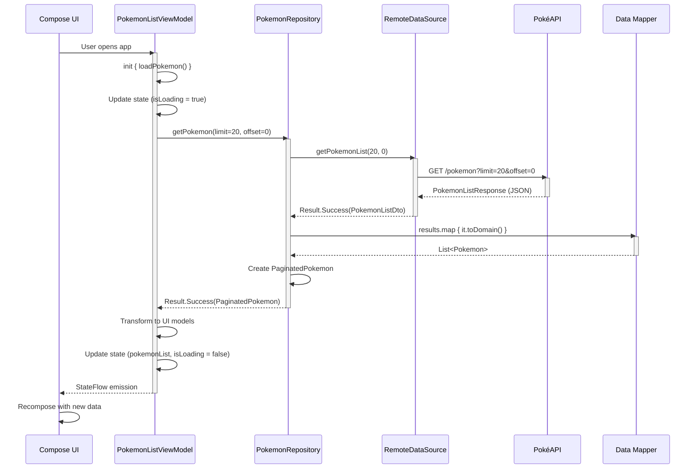
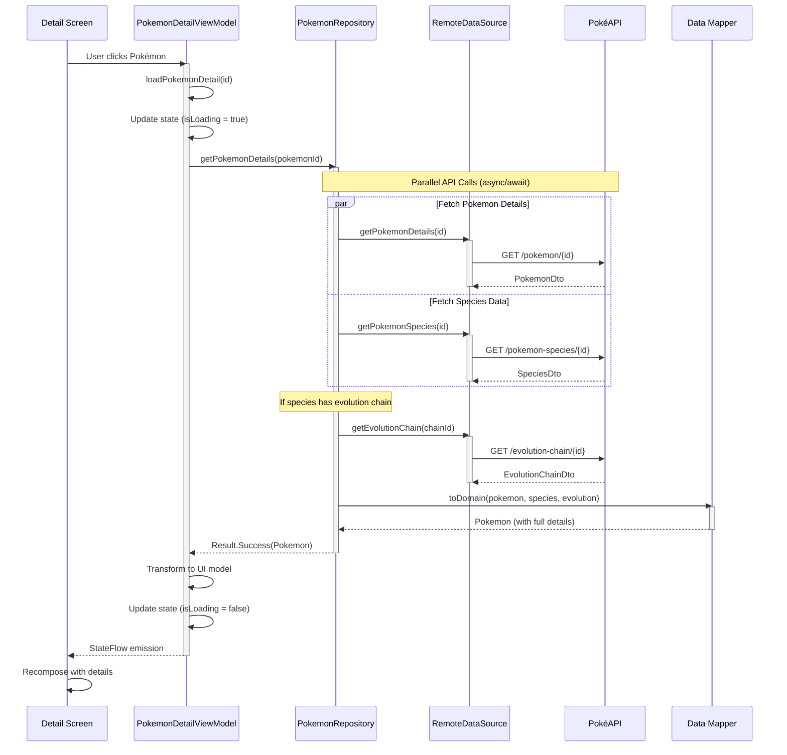
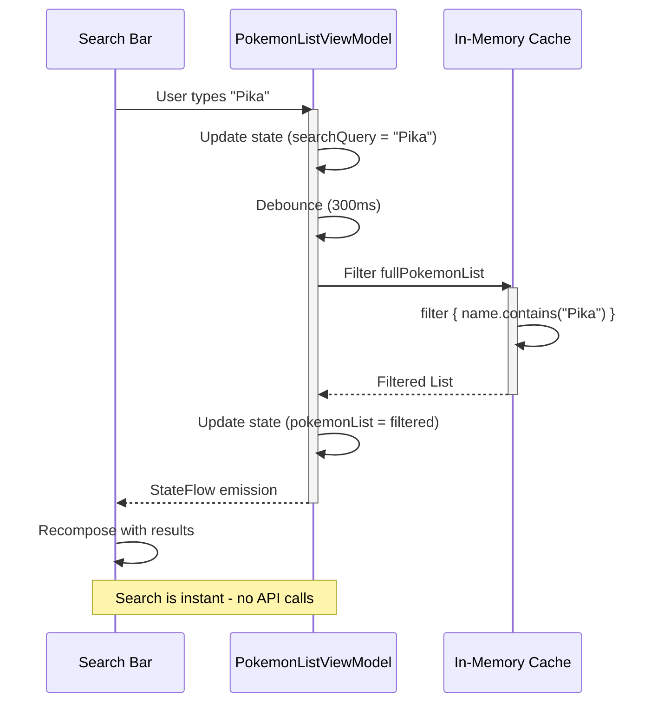
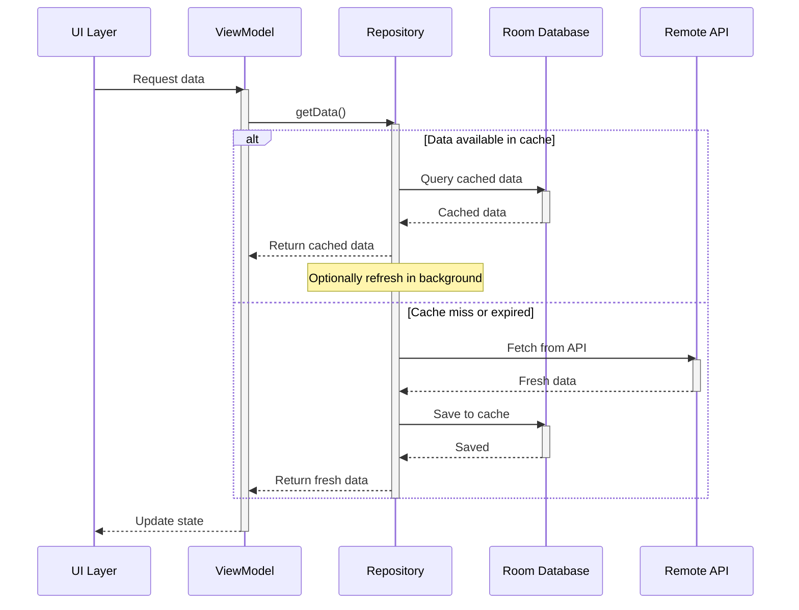

<div align="center">

#  PokePedia

### A Modern Kotlin Multiplatform Pokémon Encyclopedia

[](https://kotlinlang.org)
[](https://github.com/JetBrains/compose-multiplatform)
[](https://ktor.io/)
[](https://developer.android.com/jetpack/androidx/releases/room)
[](LICENSE)

[Features](#-features) • [Architecture](#%EF%B8%8F-architecture) • [Sequence Diagrams](#-data-flow-sequence-diagrams) • [Getting Started](#-getting-started) • [Contributing](#-contributing)

</div>

---

## 📱 About

**PokePedia** is a modern, cross-platform Pokémon encyclopedia application built with Kotlin Multiplatform and Compose Multiplatform. It provides a seamless experience for exploring Pokémon data across Android, iOS, and Desktop platforms with offline-first architecture and beautiful Material 3 design.

Powered by [PokéAPI](https://pokeapi.co/), PokePedia offers comprehensive Pokémon information including stats, abilities, types, evolution chains, and more - all with a clean, intuitive interface optimized for different screen sizes.

---

## ✨ Features

### 🔍 Core Features
- **📚 Browse Pokémon**: Explore an extensive database of Pokémon with infinite scroll pagination
- **🔎 Smart Search**: Real-time search with instant filtering of Pokémon by name
- **📊 Detailed Information**: View comprehensive stats, abilities, types, and characteristics
- **🧬 Evolution Chains**: Visualize complete evolution paths with methods and requirements
- **🎨 Type Colors**: Dynamic theming based on Pokémon types with Material Kolor
- **📈 Stats Visualization**: Visual representation of base stats with comparison

---

## 📸 Screenshots

### Android

| List | Detail |
|:----:|:------:|
|  |  |

### iOS

| List | Detail |
|:----:|:------:|
|  |  |

### Desktop

| Screenshot |
|:----------:|
|  |


---

## 🏗️ Architecture

PokePedia follows **Clean Architecture** principles with clear separation of concerns, ensuring maintainability, testability, and scalability.

### 📐 Architecture Layers

```
┌────────────────────────────────────────────────────────────────┐
│                     PRESENTATION LAYER                         │
│                                                                │
│  ┌──────────────┐  ┌──────────────┐  ┌──────────────┐          │
│  │  Android UI  │  │   iOS UI     │  │  Desktop UI  │          │
│  │  (Compose)   │  │  (Compose)   │  │  (Compose)   │          │
│  └──────────────┘  └──────────────┘  └──────────────┘          │
│                                                                │
│  ┌────────────────────────────────────────────────────────┐    │
│  │           ViewModels & State Management                │    │
│  │     (PokemonListViewModel, PokemonDetailViewModel)     │    │
│  │                                                        │    │
│  │  • StateFlow for reactive state                        │    │
│  │  • Action-based event handling                         │    │
│  │  • UI state transformations                            │    │
│  └────────────────────────────────────────────────────────┘    │
└────────────────────────────────────────────────────────────────┘
                              │
                              ▼
┌────────────────────────────────────────────────────────────────┐
│                       DOMAIN LAYER                             │
│                                                                │
│  ┌────────────────────────────────────────────────────────┐    │
│  │                  Business Logic                        │    │
│  │                                                        │    │
│  │  • Entities: Pokemon, PokemonType, Stats, Species      │    │
│  │  • Interfaces: PokemonRepository                       │    │
│  │  • Error Handling: Result, DataError                   │    │
│  │                                                        │    │
│  │  • Pure Kotlin - No framework dependencies             │    │
│  │  • Platform-agnostic business rules                    │    │
│  └────────────────────────────────────────────────────────┘    │
└────────────────────────────────────────────────────────────────┘
                              │
                              ▼
┌────────────────────────────────────────────────────────────────┐
│                        DATA LAYER                              │
│                                                                │
│  ┌─────────────────────────────────────────────────────────┐   │
│  │         Repository Implementation                       │   │
│  │        (DefaultPokemonRepository)                       │   │
│  │                                                         │   │
│  │  • Coordinates data sources                             │   │
│  │  • Handles caching strategy                             │   │
│  │  • Maps DTOs to Domain models                           │   │
│  └─────────────────────────────────────────────────────────┘   │
│                                                                │
│  ┌──────────────────────┐      ┌──────────────────────┐        │
│  │  Remote Data Source  │      │  Local Data Source   │        │
│  │      (PokéAPI)       │      │    (Room Database)   │        │
│  │                      │      │                      │        │
│  │  • Ktor HTTP Client  │      │  • SQLite storage    │        │
│  │  • JSON parsing      │      │  • DAO operations    │        │
│  │  • API endpoints     │      │  • Offline cache     │        │
│  └──────────────────────┘      └──────────────────────┘        │
└────────────────────────────────────────────────────────────────┘
```

### 🔄 Data Flow Sequence Diagrams

#### 1. Pokémon List Loading Flow



#### 2. Pokémon Detail Loading Flow



#### 3. Search Flow



#### 4. Offline-First Caching Strategy



---

## 🛠️ Tech Stack

### Core Framework
| Technology | Version | Purpose |
|------------|---------|---------|
| [Kotlin](https://kotlinlang.org/) | 2.2.20 | Primary programming language |
| [Compose Multiplatform](https://www.jetbrains.com/lp/compose-multiplatform/) | 1.9.0 | Declarative UI framework |
| [Kotlin Multiplatform](https://kotlinlang.org/docs/multiplatform.html) | 2.2.20 | Cross-platform code sharing |

### Networking & Serialization
| Technology | Version | Purpose |
|------------|---------|---------|
| [Ktor Client](https://ktor.io/) | 3.3.0 | HTTP client for API calls |
| [Kotlinx Serialization](https://github.com/Kotlin/kotlinx.serialization) | 1.9.0 | JSON parsing and serialization |

### Local Storage
| Technology | Version | Purpose |
|------------|---------|---------|
| [Room](https://developer.android.com/jetpack/androidx/releases/room) | 2.8.1 | Local database with type-safe queries |
| [SQLite Bundled](https://developer.android.com/jetpack/androidx/releases/sqlite) | 2.6.1 | Embedded database engine |

### Dependency Injection
| Technology | Version | Purpose |
|------------|---------|---------|
| [Koin](https://insert-koin.io/) | 4.1.1 | Lightweight dependency injection |

### Architecture Components
| Technology | Version | Purpose |
|------------|---------|---------|
| [AndroidX Lifecycle](https://developer.android.com/jetpack/androidx/releases/lifecycle) | 2.9.4 | ViewModel and lifecycle management |
| [AndroidX Navigation](https://developer.android.com/jetpack/androidx/releases/navigation) | 2.9.0 | Type-safe navigation |
| [Kotlinx Coroutines](https://github.com/Kotlin/kotlinx.coroutines) | 1.10.2 | Asynchronous programming |

### UI & Design
| Technology | Version | Purpose |
|------------|---------|---------|
| [Material 3](https://m3.material.io/) | Latest | Material Design components |
| [Material Icons Extended](https://developer.android.com/jetpack/androidx/releases/compose-material) | 1.7.3 | Comprehensive icon library |
| [Material Kolor](https://github.com/jordond/materialkolor) | 3.0.1 | Dynamic color theming from images |
| [Compose Adaptive](https://developer.android.com/jetpack/androidx/releases/compose-material3-adaptive) | 1.2.0-alpha06 | Adaptive layouts for different screens |
| [Coil](https://coil-kt.github.io/coil/) | 3.3.0 | Image loading with caching |

### Development Tools
| Technology | Version | Purpose |
|------------|---------|---------|
| [KSP](https://github.com/google/ksp) | 2.2.20-2.0.3 | Kotlin Symbol Processing |
| [BuildConfig](https://github.com/gmazzo/gradle-buildconfig-plugin) | 5.6.8 | Build-time configuration |
| [Kermit](https://github.com/touchlab/Kermit) | 2.0.8 | Multiplatform logging |
| [Hot Reload](https://github.com/JetBrains/compose-hot-reload) | 1.0.0-beta08 | Fast development iteration |

### Testing
| Technology | Version | Purpose |
|------------|---------|---------|
| [Kotlinx Coroutines Test](https://github.com/Kotlin/kotlinx.coroutines) | 1.10.2 | Coroutine testing utilities |
| [Compose UI Test](https://developer.android.com/jetpack/compose/testing) | Latest | UI testing for Compose |
| [JUnit 4](https://junit.org/junit4/) | Latest | Unit testing framework |

---

## 🚀 Getting Started

### Running the Application

#### Android
```bash
# Using Gradle
./gradlew :composeApp:installDebug

# Or using Android Studio
# Select "composeApp" configuration and click Run ▶️
```

#### iOS (macOS only)
```bash
# Open iOS project in Xcode
open iosApp/iosApp.xcodeproj

# Or run directly from Android Studio
# Select "iosApp" configuration and choose a simulator
```

#### Desktop
```bash
# Run on current OS
./gradlew :composeApp:run

# Or using Android Studio
# Select "composeApp" → "Desktop" and click Run ▶️
```

---

## 🔨 Building for Production

### Android

#### Generate APK
```bash
./gradlew :composeApp:assembleRelease
# Output: composeApp/build/outputs/apk/release/composeApp-release.apk
```

#### Generate AAB (Play Store)
```bash
./gradlew :composeApp:bundleRelease
# Output: composeApp/build/outputs/bundle/release/composeApp-release.aab
```

### iOS

#### Debug Build
```bash
./gradlew :composeApp:linkDebugFrameworkIosArm64
```

#### Release Build
```bash
./gradlew :composeApp:linkReleaseFrameworkIosArm64
# Then build in Xcode for App Store submission
```

### Desktop

#### Package for Current OS
```bash
./gradlew :composeApp:packageDistributionForCurrentOS
```

#### Specific Formats
```bash
# macOS DMG
./gradlew :composeApp:packageDmg

# Windows MSI
./gradlew :composeApp:packageMsi

# Linux DEB
./gradlew :composeApp:packageDeb
```

**Outputs:**
- macOS: `composeApp/build/compose/binaries/main/dmg/`
- Windows: `composeApp/build/compose/binaries/main/msi/`
- Linux: `composeApp/build/compose/binaries/main/deb/`

---

### Contribution Guidelines

- Write clean, readable, and maintainable code
- Follow the project's architecture patterns (see [ARCHITECTURE.md](ARCHITECTURE.md))
- Add appropriate comments and documentation
- Write unit tests for new functionality
- Ensure backward compatibility
- Update the README if you add new features

---

## 📄 License

This project is licensed under the **MIT License** - see the [LICENSE](LICENSE) file for details.

```
MIT License

Copyright (c) 2024 Somesh Kumar

Permission is hereby granted, free of charge, to any person obtaining a copy
of this software and associated documentation files (the "Software"), to deal
in the Software without restriction, including without limitation the rights
to use, copy, modify, merge, publish, distribute, sublicense, and/or sell
copies of the Software, and to permit persons to whom the Software is
furnished to do so, subject to the following conditions:

The above copyright notice and this permission notice shall be included in all
copies or substantial portions of the Software.
```

---

## 🙏 Acknowledgments

This project wouldn't be possible without these amazing resources:

- **[PokéAPI](https://pokeapi.co/)** - Free and open Pokémon API
- **[JetBrains](https://www.jetbrains.com/)** - Kotlin and IntelliJ IDEA
- **[Kotlin Multiplatform](https://kotlinlang.org/docs/multiplatform.html)** - Cross-platform development
- **[Compose Multiplatform](https://www.jetbrains.com/lp/compose-multiplatform/)** - Modern UI framework
- **[Material Design](https://m3.material.io/)** - Design system and guidelines
- **Android & iOS Communities** - For excellent documentation and support

---

## 📞 Contact & Support

### 👨‍💻 Developer

**Somesh Kumar**

- 🐙 GitHub: [@TheSomeshKumar](https://github.com/TheSomeshKumar)
- 💼 LinkedIn: [linkedin.com/in/thesomeshkumar](https://linkedin.com/in/thesomeshkumar)
- 🐦 Twitter: [@TheSomeshKumar](https://twitter.com/TheSomeshKumar)

<div align="center">

### ⭐ Star this repository if you find it helpful!
 
**Made with ❤️ and Kotlin Multiplatform**

[⬆ Back to Top](#-pokepedia)

</div>
